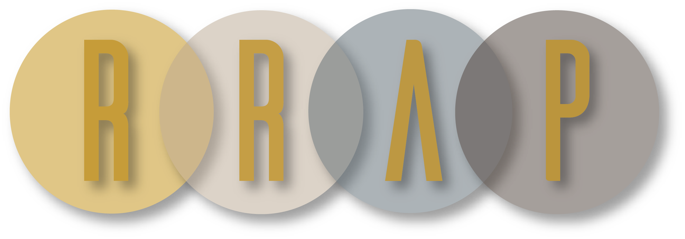

# Atlas Gimbal
**Gimbal File Storage for the Atlas Project's Gimbal**

## Overview

We need a gimbal for the rocket. This repository holds that gimbal.

## Roadmap

- [ ] Decide on generic gimbal design
- [ ] Run FEA on parts to ensure solid design
- [ ] Run a test print of the system
- [ ] First manufacturing and test
- [ ] Design freeze
